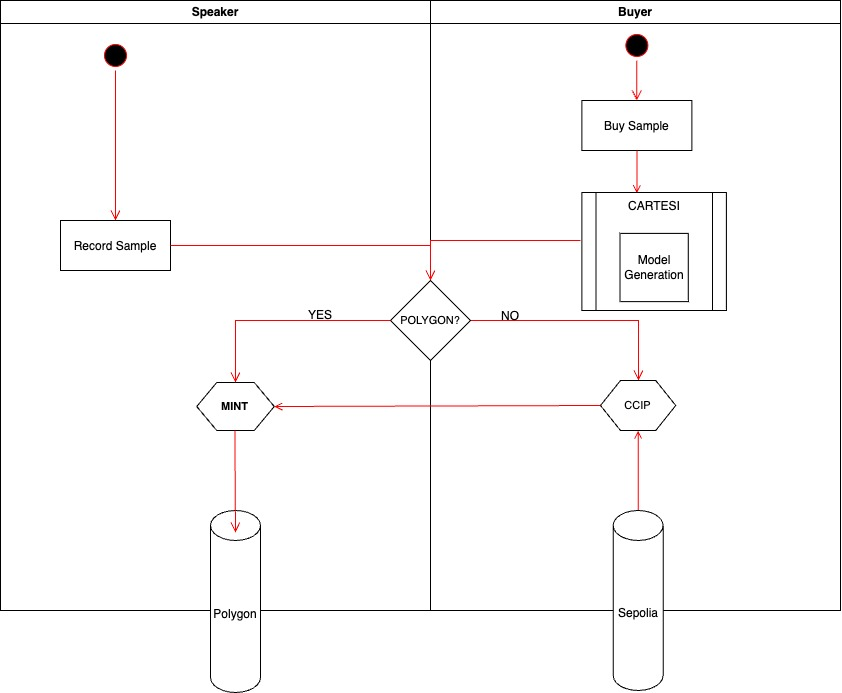

# dub3.ai 🗣️

Welcome to dub3.ai, where your voice takes center stage! 🎤

## About

dub3.ai is an innovative marketplace harnessing the power of Cartesi, enabling users to transform their voice into unique NFTs and generate text-to-speech content using cutting-edge AI technology. 🌟

## Project Goal

Our main objective is to empower users to effortlessly upload and monetize their voice samples. These samples undergo advanced processing through the Coqui/TTS library by Hugging Face. The magic unfolds within the Cartesi environment, ensuring seamless, efficient, and reliable execution. Once synthesized, the resulting voice is securely uploaded to IPFS (InterPlanetary File System). Simultaneously, an exclusive NFT is minted, representing this synthesized voice as a one-of-a-kind digital asset. 💫

## How It Works

1. **Upload Your Voice:** Share your unique voice samples.
2. **AI Synthesis:** Cutting-edge AI processes your voice via the Coqui/TTS library.
3. **Cartesi Environment:** Seamless execution within the Cartesi environment.
4. **IPFS Storage:** Securely store the synthesized voice on IPFS.
5. **NFT Creation:** Mint a unique NFT representing your synthesized voice.

## Getting Started

### Building

To get started, execute the following command from the project's directory:

yarn 

### Running
Once the back-end is up and running, open a separate terminal in this project's directory, and execute:

yarn start
This will run the front-end application in development mode.

Open http://localhost:3000 to view it in your browser.

## Tech Stack
For this project several components have been integrated.

### Cartesi
It is used to execute the Text2Speech model inference and various actions such as uploading the output file to ipfs via Pinata.

### Chainlink 
Chainlink CCIP is used to enable cross-chain communication in order to mint the NFTs on Polygon Mumbai from other chains. 

### Lighthouse
Lighthouse is used to store securely the audio files generated by the AI.

### Scroll
Scroll Sepolia is the chain where we deployed and verified our SpeakerNFT contract.
Explorer : https://sepolia-blockscout.scroll.io/address/0xB7C1D2626FE677fbA9789dcD089F800BA0A8Bf00

## Contract Addresses

### SpeakerNFT
Polygon MUMBAI : 0x938049a537939AC054FFF6E0CafCe39D726BDd9c 

Scroll Sepolia : 0xB7C1D2626FE677fbA9789dcD089F800BA0A8Bf00 

### BuyerNFT
Polygon MUMBAI : 0x59087174Dd6F511C73e62618DaeE710F2db0819F

### CCIP SourceMinter
Ethereum SEPOLIA : 0x7e28Bca799F90AB6e8264E93B123cE9990987567

### CCIP DestinationMinter
Ethereum SEPOLIA : 0xF0228036FC21aD442250d4c887F492c50b5A3A37